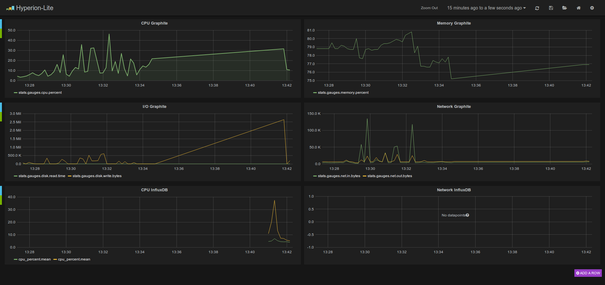

# Hyperion-Lite

[![License GPL 3][badge-license]][COPYING]
[](https://app.wercker.com/project/bykey/a6dff1d550ed9c6aa3c466045bf1d51f)

## Description

[Hyperion-Lite][] is a [Docker][] (>= 0.11) image (Ubuntu 14.04 based) containing :
* [Hyperion-Lite][] web description : `http://xxx:9990`
* [Elasticsearch][] (v1.2.1) web interface : `http://xxx:9992/elasticsearch/`
* [Grafana][] (v1.6.1) web interface : `http://xxx:9990/grafana/`
* [Kibana][] (v3.1.0) web interface : `http://xxx:9990/kibana/`
* [Graphite][] (v3.1.0) web interface : `http://xxx:9990/graphite/`
* [Statsd][] (v0.7.1) daemon on `8125` and `8126`
* [Supervisor][] is used to manage processes.
* [InfluxDB][] (v0.7.3) web interface : `http://xxx:8083`

Some [Elasticsearch][] plugins are available:
* [ElasticSearchHead][]: `http://xxx:9992/_plugin/head/`
* [ElasticHQ][]: `http://xxx:9992/_plugin/HQ/`
* [Kopf][]: `http://xxx:9992/_plugin/kopf/`





## Deployment

### Local

Use this [script](client/hyperion.sh) to help you to local deployment :
```bash
$ client/hyperion.sh help
Usage: client/hyperion.sh <command>
Commands:
  pull      :    Pull the Hyperion-Lite image from the registry
  start     :    Start Hyperion-Lite container
  stop      :    Stop Hyperion-Lite container
  help      :    Display this help
```

* Install it:

        $ ./hyperion.sh pull && ./hyperion.sh start

* For [Graphite][] metrics, you could test your local installation using [hyperion_statsd.py](client/hyperion_statsd.py):

        $ pip install -r requirements.txt
        $ ./client/hyperion_statsd.py

* For [InfluxDB][] metrics, you could test your installation using [sysinfo_influxdb][]:

        $ curl -X POST 'http://localhost:8086/db?u=root&p=root' \
            -d '{"name": "hyperion-lite"}'
        $ sysinfo_influxdb -host 127.0.0.1:8086 -P hyperion-lite -d hyperion-lite -v=text -D

* Go to `http://localhost:9990/grafana` to see dashboard metrics


### Virtualbox

A `Vagrantfile` using [CoreOS][] (version 324.2.0) is provided if you want to use it in a virtual machine.
<> This virtual machine is sharing volume `/var/docker/hyperion-lite` between host and guest machine to store metrics.

* Install dependencies : [Virtualbox][] (>= 4.3.10), [Vagrant][] (>= 1.6), NFS server

* Launch VM:

        $ vagrant up

* Test your [Graphite][] metrics using [hyperion_client.py](client/hyperion_statsd.py):

        $ ./hyperion_statsd.py -s 10.2.4.6 -p 8125

* Test your [InfluxDB][] metrics using [hyperion_statsd.py](client/hyperion_statsd.py):

        $ curl -X POST 'http://10.2.4.6:8086/db?u=root&p=root' \
            -d '{"name": "hyperion-lite"}'
        $ sysinfo_influxdb -host 10.2.4.6:8086 -P hyperion-lite -d hyperion-lite -v=text -D

* Go to `http://10.2.4.6:9990/grafana/`

* You could connect to your virtual machine by ssh to manage your installation using [CoreOS][] tools ([Etcd][] and [Fleet][] and [Systemd][]).

        $ vagrant ssh
        $ fleetctl list-units
        UNIT			STATE		LOAD	ACTIVE	SUB	DESC		MACHINE
        hyperion-lite.service	launched	loaded	active	running	Hyperion-Lite	c1adaa61.../10.1.2.3
        $ fleetctl status hyperion-lite.service
        ● hyperion-lite.service - hyperion-lite
           Loaded: loaded (/etc/systemd/system/hyperion-lite.service; linked-runtime)
           Active: active (running) since Tue 2014-07-07 23:28:58 UTC; 15min ago
           Process: 3620 ExecStartPost=/usr/bin/etcdctl set /hyperion-lite/host ${COREOS_PUBLIC_IPV4} (code=exited, status=0/SUCCESS)
           Main PID: 3619 (docker)
              CGroup: /system.slice/hyperion-lite.service
                  └─3619 /usr/bin/docker run --rm -v /var/docker/hyperion-lite/elasticsearch:/var/lib/elasticsearch -v /var/docker/hyperion-lite/graphite:/var/lib/graphite/storage/whisper -v /var/docker/hyperion-lite/supervisor:/var/log/supervisor -v /var/docker/hyperion-lite/nginx:/var/log/nginx -p 9990:80 -p 9992:9200 -p 9979:6379 -p 8083:8083 -p 8086:8086 -p 8125:8125/udp -p 2003:2003/tcp --name hyperion-lite nlamirault/hyperion-lite:0.6.0
        $ journalctl -f -u hyperion-lite.service
        fleetctl journal -f hyperion-lite.service
        -- Logs begin at Tue 2014-07-07 23:28:24 UTC. --
        Jul 07 23:28:57 hyperion-lite systemd[1]: Starting hyperion-lite...
        Jul 07 23:28:58 hyperion-lite systemd[1]: Started hyperion-lite.
        Jul 07 23:28:58 hyperion-lite docker[3619]: Unable to find image 'nlamirault/hyperion-lite:0.6.0' locally
        Jul 07 23:28:58 hyperion-lite docker[3619]: Pulling repository nlamirault/hyperion-lite


## Usage

You could use [Hyperion-Lite][] to collect event and logs from hosts.

### Fluentd

Using this file [fluent.conf][] for [Fluentd][] and send logs :

    $ gem install fluentd
    $ gem install fluent-plugin-elasticsearch
    $ fluentd -c fluent.conf

### Heka

Using this file [hekad.toml][] for [Heka][] and send logs :

    $ wget https://github.com/mozilla-services/heka/releases/download/v0.5.2/heka_0.5.2_amd64.deb
    $ dpkg -i heka_0.5.2_amd64.deb
    $ hekad -config=hekad.toml


## Development

* Build the container :

        $ make clean && make

* Setup directories :

        $ sudo mkdir -p /var/docker/hyperion-lite/{elasticsearch,graphite,supervisor,nginx}

* Start the container :

        $ make start

* You could launch unit tests using local installation or VM installation :

        $ pip install -r test-requirements.txt
        $ tox
        $ tox -evm


## Support

Feel free to ask question or make suggestions in our [Issue Tracker][].


## License

Hyperion-Lite is free software: you can redistribute it and/or modify it under the
terms of the GNU General Public License as published by the Free Software
Foundation, either version 3 of the License, or (at your option) any later
version.

Hyperion-Lite is distributed in the hope that it will be useful, but WITHOUT ANY
WARRANTY; without even the implied warranty of MERCHANTABILITY or FITNESS FOR A
PARTICULAR PURPOSE.  See the GNU General Public License for more details.

See [COPYING][] for the complete license.


## Changelog

A changelog is available [here](ChangeLog.md).


## Contact

Nicolas Lamirault <nicolas.lamirault@gmail.com>


[Hyperion-Lite]: https://github.com/nlamirault/hyperion-lite
[COPYING]: https://github.com/nlamirault/hyperion-lite/blob/master/COPYING
[Issue tracker]: https://github.com/nlamirault/hyperion-lite/issues
[fluent.conf]: https://github.com/nlamirault/hyperion-lite/blob/master/logs/fluent.conf
[hekad.toml]: https://github.com/nlamirault/hyperion-lite/blob/master/logs/hekad.toml

[badge-license]: https://img.shields.io/badge/license-GPL_3-green.svg?style=flat

[Docker]: https://www.docker.io
[Docker documentation]: http://docs.docker.io
[CoreOS]: http://coreos.com
[Etcd]: http://coreos.com/using-coreos/etcd
[Fleet]: http://coreos.com/using-coreos/clustering/
[Nginx]: http://nginx.org
[Elasticsearch]: http://www.elasticsearch.org
[Redis]: http://www.redis.io
[Graphite]: http://graphite.readthedocs.org/en/latest
[Grafana]: http://grafana.org/
[Kibana]: http://www.elasticsearch.org/overview/kibana/
[Carbon]: http://graphite.readthedocs.org/en/latest/carbon-daemons.html
[Statsd]: https://github.com/etsy/statsd/wiki
[ElasticSearchHead]: http://mobz.github.io/elasticsearch-head
[ElasticHQ]: http://www.elastichq.org
[Kopf]: https://github.com/lmenezes/elasticsearch-kopf
[Virtualbox]: https://www.virtualbox.org
[Vagrant]: http://downloads.vagrantup.com
[Fluentd]: http://fluentd.org/
[Heka]: http://hekad.readthedocs.org/en/latest/
[Supervisor]: http://supervisord.org
[sysinfo_influxdb]: https://github.com/novaquark/sysinfo_influxdb
[InfluxDB]: http://influxdb.com
